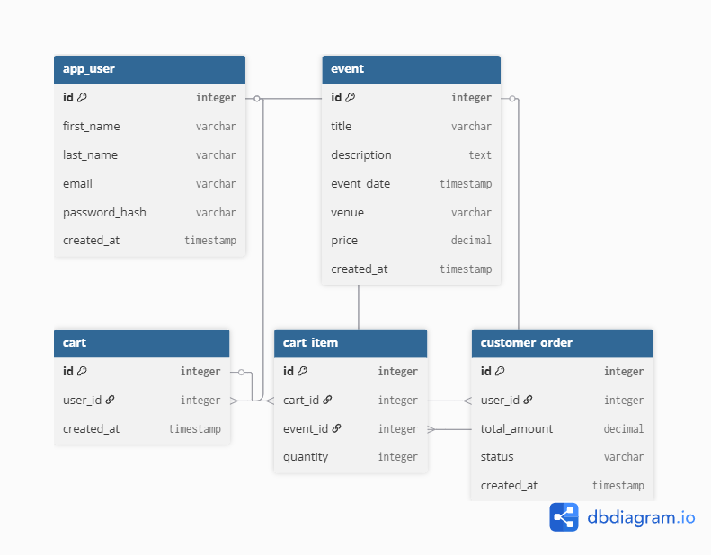

# Week 1 – Backend Database Setup (Events Startup Project)

## Overview
This week focused on designing and implementing the foundational database for the Events Startup Project using **PostgreSQL** and raw SQL scripts. 
---
## ERD (Entity Relationship Diagram)
The database design includes the core entities for Week 1, with planning for future sprint features (Cart, Orders):
- `app_user` table (Named `app_user` to avoid the SQL reserved word `user`)
- `event` table (Catalog items for tickets)
**Planned Future Relationships:**
- A user can have one cart (or checkout as a guest)
- A cart contains multiple cart items linked to specific events
- An order is linked to an authenticated user
📌 **ERD Diagram:**
 
---
## Database Setup
### Tools used:
- **PostgreSQL** (Core relational database)
- **DBeaver** (Database management and SQL execution)
- **dbdiagram.io** (ERD modeling)
---
## Database Schema (`schema.sql`)
Tables created via standard PostgreSQL scripts:
### app_user
- `id` (SERIAL, Primary Key)
- `first_name` (VARCHAR, NOT NULL)
- `last_name` (VARCHAR, NOT NULL)
- `email` (VARCHAR, UNIQUE, NOT NULL)
- `password_hash` (VARCHAR, NOT NULL)
- `created_at` (TIMESTAMP)
### event
- `id` (SERIAL, Primary Key)
- `title` (VARCHAR, NOT NULL)
- `description` (TEXT)
- `event_date` (TIMESTAMP, NOT NULL)
- `venue` (VARCHAR, NOT NULL)
- `price` (DECIMAL, NOT NULL)
- `created_at` (TIMESTAMP)
---
## Seed Data (`seed.sql`)
Initial dummy data was inserted directly into PostgreSQL to allow for testing:
- 1 test user (Jane Doe)
- 3 event records (Summer Music Festival, Tech Conference, Standup Comedy Night)
---
## SQL Queries (Manual Testing via `queries.sql`)
Manual testing was performed in DBeaver to ensure data integrity.
### Get all events
```sql
SELECT * FROM event ORDER BY event_date ASC;
Get event by ID
SELECT * FROM event WHERE id = 1;
API Testing
The application is configured to connect to PostgreSQL. The following endpoints represent the minimum API expectations for fetching the catalog data:
Get all events
GET http://localhost:3001/api/events
How to run project locally
1. Database Setup (DBeaver)
Connect to PostgreSQL and create a database named events_startup.
Open a new SQL Editor in DBeaver.
Run the code from database/schema.sql to build the tables.
Run the code from database/seed.sql to insert the test data.
2. Environment Configuration
Navigate into the api folder.
Duplicate the .env-template file and rename the copy to .env.
Update the .env file to point to the PostgreSQL database on Port 3001:
PORT=3001
DB_CLIENT=pg
DB_PORT=5432
DB_USER=postgres
DB_PASSWORD=*****
DB_DATABASE_NAME=events_startup
3. Start the Server
# Navigate to the API folder 
cd api
# Install dependencies
npm install
# Run the development server
npm run dev
Then open in your browser or Postman:
http://localhost:3001/api/events

