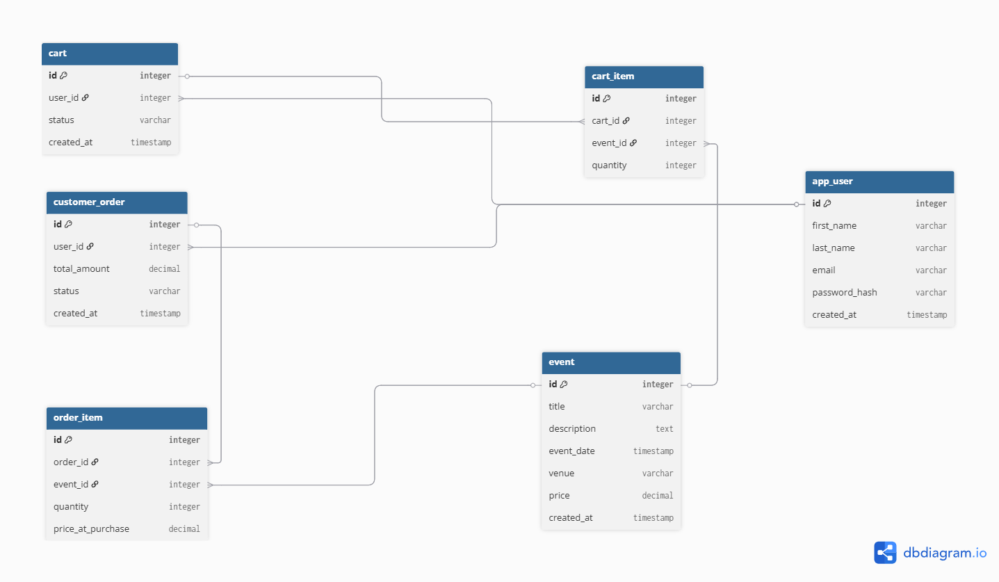

# Week 2 – Complete Database Structure (Events Startup Project)

## Overview

The goal of this sprint was to finalize the database structure to support cart, checkout, and order flows using PostgreSQL, while adhering to strict naming conventions and data integrity rules.

---

## 🗄️ ERD (Entity Relationship Diagram) v2

The core database has been expanded to include the e-commerce engine:

- `cart` and `cart_item`
- `customer_order` and `order_item`

📌 **Updated ERD Diagram:**

_(Note: Visualizes all tables and Foreign Key relationships)_

---

## ⚙️ Schema Design Decisions

### 1. Avoiding Reserved Words

To prevent SQL syntax errors, the generic `order` concept was implemented as the `customer_order` table.

### 2. Cart Line Key Strategy

I chose the **Project default: a simple single primary key (`id`)** for `cart_item` and `order_item`. This keeps the schema straightforward for this sprint while still uniquely identifying every row.

### 3. Guest Checkout Support

The `user_id` column in the `cart` table is **nullable**. This specifically allows unauthenticated users (guests) to create carts and add items before being forced to log in or register.

### 4. "One Active Cart" Enforcement

To enforce the rule that an authenticated user can only have one active cart at a time, I implemented a **Partial Unique Index** at the database level:

```sql
CREATE UNIQUE INDEX idx_one_active_cart_per_user
ON cart (user_id)
WHERE status = 'active';
```

Advanced SQL Queries (queries.sql)
The following logic was implemented and tested to support the PRD flow:

Paginated item listing (LIMIT, sorting)

SELECT id, title, event_date, price
FROM event
ORDER BY event_date ASC
LIMIT 5 OFFSET 0;

Cart subtotal calculation

SELECT ci.cart_id, SUM(ci.quantity \* e.price) AS cart_subtotal
FROM cart_item ci
JOIN event e ON ci.event_id = e.id
WHERE ci.cart_id = 1
GROUP BY ci.cart_id;

Order totals snapshot logic
(Uses price_at_purchase to ensure historical orders don't change if catalog prices change)

SELECT co.id AS order_id, SUM(oi.quantity \* oi.price_at_purchase) AS line_total
FROM customer_order co
JOIN order_item oi ON co.id = oi.order_id
WHERE co.id = 1
GROUP BY co.id;
